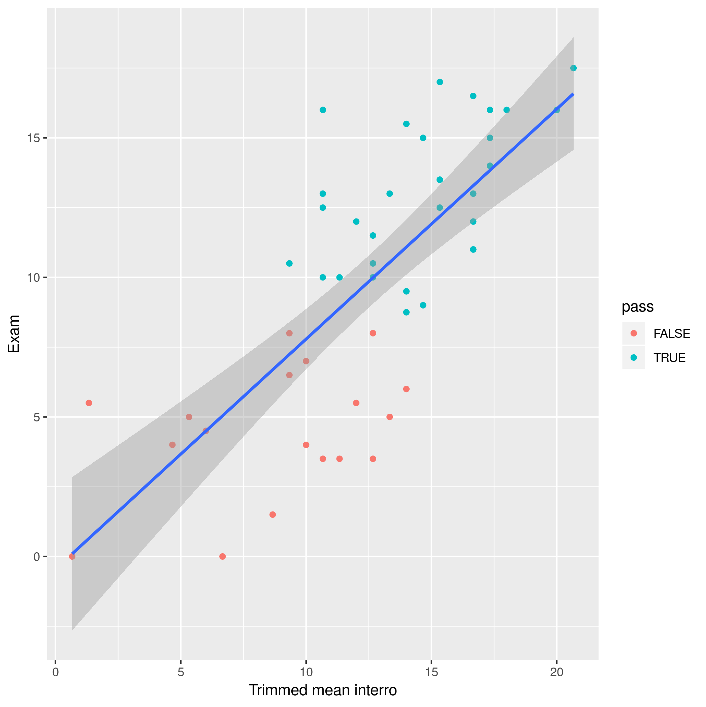

## Information générales

- [Descriptif du cours](https://uclouvain.be/cours-2019-wsbim1322.html)
- Titulaire: Prof Laurent Gatto
- Assistants: Dr. Axelle Loriot, Jean Fain, Valentine Robaux
- Notes de cours: http://bit.ly/WSBIM1322
- Informations aux étudiants (ce document): http://bit.ly/WSBIM1322info

----

- Pour toutes **questions concernant le cours**, veuillez utiliser le
  forum
  [moodle](https://moodleucl.uclouvain.be/course/view.php?id=12831).
  Toute question posée par email sera transférée sur moodle et la
  réponse y sera apportée de telle manière à ce que tous les étudiants
  profitent de la réponse. Les étudiants sont par ailleurs invités a
  répondre aux questions de leurs collègues. **N'oubliez pas de vous
  inscrire!**

- Quand vous poser vos questions sur moodle, il vous est demandé de
  **décrire ce que vous avez déjà essayé/testé**. 

- Les notes de cours sont en anglais, mais le cours se donnera en
  français.

- Le cours sera mis à jour regulièrement pour répondre aux
  questions et commentaires abordés durant le cours.

- Il est fortement conseillé de participer activement durant les cours,
  et de faire les exercices aussi bien pendant le cours que ceux
  proposés comme travail à domicile.

- La **présence des étudiants à l'ensemble des cours (volumes 1 et 2)
  est obligatoire**. Ceci est aussi valable pour les bisseurs. Il est
  essentiel de prendre contact avec le titulaire du cours au plus vite
  si vous n'êtes pas en mesure de suivre le cours. Les présences
  seront comptabilisées. **N'oubliez pas de signer à chaque
  cours!**

- En case de trois absences non justifiées, l'étudiant(e) pourra se
  voir refuser la participation **aux examens** de fin de cours.

- Il y aura des interrogations cotées en début de certaines
  sessions. Ces cotes compteront pour 25% de la note finale. Le
  meilleur moyen de vous y préparer et de faire et comprendre les
  exercices en cours et à domicile.

- Le nombre et durée des pauses dépendra du [vote des
  étudiant(e)s](https://moodleucl.uclouvain.be/mod/choice/view.php?id=764607).

Ce qui est attendu de vous:

- **Interactions** entre étudiants et enseignants: posez des questions,
  n'hésitez pas à vous entraider durant les résolutions de problèmes.

- Un **apprentissage actif**. Il ne vous sera pas possible de
  comprendre la matière en apprenant le cours par coeur. C'est la
  pratique qui vous permettra de la maîtriser: tentez donc les
  exercices et si vous n'y arrivez pas, posez des questions.

- Donnez-nous un **feed-back approprié**, pour que nous puissions
  vous aidez en proposant davantages d'exercices et/ou en clarifiant
  des parties du cours. Ce feed-back se fera pendant les cours
  (questions et réponses) et en fin de session (post-its).

- Travaillez regulièrement, en particulier en participant activement
  au cours. N'attendez pas la fin du cours pour vous y mettre!

La figure ci-dessous vous montre la
corrélation entre la moyennes des interrogations et la cote à l'examen
final. La conclusion étant que de travail régulier, qui se traduit par
des bons résultats durant les interrogations, est un bon prédicateur du
succès à l'examen.


```{r scores, echo = FALSE}

```

## Horaire

|    | Jour              | Horaire       | Matière |
|----|-------------------|---------------|---------|
| 1  | Lundi  23/09/2020 | 08h30 - 12h30 |         |
| 2  | Lundi  30/09/2020 | 08h30 - 12h30 |         |
| 3  | Lundi  07/10/2020 | 08h30 - 12h30 |         |
| 4  | Lundi  21/10/2020 | 08h30 - 12h30 |         |
| 5  | Lundi  28/10/2020 | 08h30 - 12h30 |         |
| 6  | Lundi  04/11/2020 | 08h30 - 12h30 |         |
| 7  | Lundi  18/11/2020 | 08h30 - 12h30 |         |
| 8  | Lundi  25/11/2020 | 08h30 - 12h30 |         |
| 9  | Lundi  02/12/2020 | 08h30 - 12h30 |         |
| 10 | Lundi  16/12/2020 | 08h30 - 12h30 |         |


NB: la matière reprise ci-dessus est à titre indicatif uniquement, et
sera adaptée en fonction de l'avancée en cours.

## Examen

- Il est vous est demandé d'être présent au moins 10 minutes à
  l'avance pour prendre place et de débuter à l'heure. Les
  retardataires ne disposeront pas de temps supplémentaire et pourront
  se faire refuser la participation à l'examen.

- Les étudiants doivent être munis de leur carte d'étudiant, qui sera
  contrôlée lors de la signature de la liste des présences.

- Il est strictement INTERDIT de porter sur soi un appareil
  électronique (GSM, MP3, PDA, appareil photo, ...) pendant
  l'examen. La découverte de l'un de ces appareils pendant l'examen,
  même éteint, sera considérée comme une tentative de fraude et le
  règlement décrit à la section 7 du règlement générale des études et
  examens (RGEE) sera appliqué.

- Il est interdit de quitter l'auditoire avant d'avoir remis sa copie
  d'examen. L’étudiant qui souhaite aller aux toilettes remet copie et
  son examen est terminé.

- En cas de suspicion de tricherie (port d'un appareil électronique,
  tentative d'entrer en contact avec le voisin, copie sur le voisin,
  transmission de feuilles ou de fichiers, etc), le constat de
  celle-ci sera fait avec témoin et l'objet de la tricherie sera
  confisqué le cas échéant. L'étudiant(e) pourra terminer l'examen, et
  il sera indiqué qu'il y a eu tricherie. La procédure décrite à la
  section 7 du RGEE sera ensuite suivie (sanction académique par le
  jury puis sanction disciplinaire possible par le vice-recteur aux
  affaires étudiantes).

<!-- - L'examen consistera en la préparation, sur ordinateur, de [rapport -->
<!--   reproductible en -->
<!--   Rmarkdown](https://uclouvain-cbio.github.io/WSBIM1207/sec-rr.html), -->
<!--   que vous nous rendrez en fin d'examen. Nous le compilerons nous -->
<!--   mêmes en format pdf, et c'est ce fichier que nous corrigerons. Les -->
<!--   questions vous seront communiquées via le page moodle du cours et -->
<!--   votre rapport sera remis par cette même page moodle. -->

<!-- - Le nombre de pages de rapport sera limité. Assurez-vous de ne pas le -->
<!--   dépasser. -->

- L'examen sera à livre ouvert - vous aurez accès à la dernière mise à
  jour en ligne des notes de cours. Vous pourrez également amener vos
  notes manuscrites si vous le désirez. Vous aurez aussi accès à vos
  répertoires personnels avec le projet et les scripts préparés en
  cours d'année (y compris le projet du professeur). Tout autre
  support est interdit, sauf autorisation exlicite du professeur.

- Vous devrez utiliser l'ordinateur de la salle pour l'examen. Des
  ordinateurs portables personnels ainsi que des tablettes ou
  téléphone portables ne seront pas autorisés.

- Les questions d'examen seront en français et vos réponses seront
  aussi en français.

- Nous ne répondrons **pas** aux questions durant l'examen.

Vous aurez un document reprenant des informations détaillées sur
l'examen et sont déroulement en temps voulu.

----

Dernière mise à jour: `r date()`
